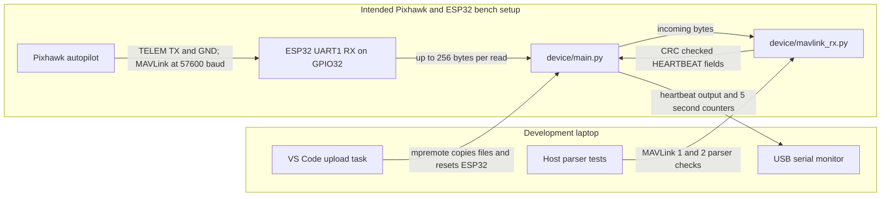
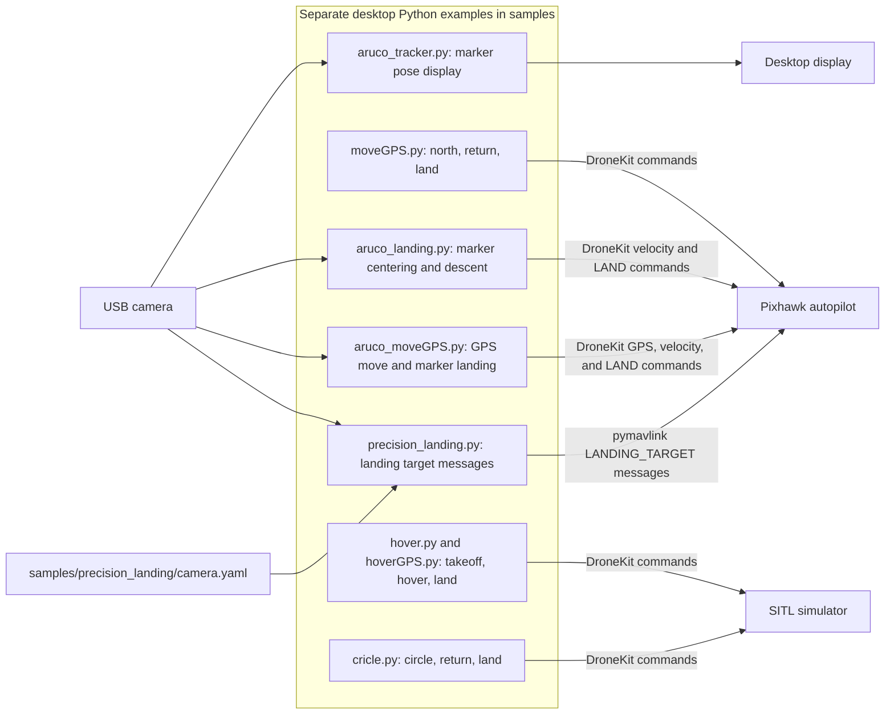

# BANSHEE system overview

This page maps the code currently in this repository. **The only deployable
ESP32 program is a receive-only Pixhawk heartbeat monitor.** The flight and
camera programs in `samples/` are separate, unchanged desktop examples. They
are not called by the ESP32 program and have not been integrated into one
mission. The diagrams describe code and intended connections; they do not
confirm that the hardware has been wired or tested.

## Current ESP32 data path

`main.py` starts after the ESP32 resets. It reads UART bytes, counts received
bytes and decoded heartbeats, and prints a status report every five seconds.
`HeartbeatParser` accepts MAVLink 1 and 2 HEARTBEAT frames, checks their CRC,
and exposes system ID, component ID, vehicle type, autopilot, base mode,
custom mode, and system status. It handles partial frames and skips corrupt
frames. MAVLink 2 signature bytes are consumed but **not authenticated**.

The intended wiring is Pixhawk TELEM TX to ESP32 GPIO32 and a shared ground.
GPIO33 is configured as UART TX but left physically disconnected. The ESP32
uses USB for upload and the serial monitor. This code does not transmit MAVLink
commands, arm the drone, read GPS coordinates, process camera images, or
control motors. The Pixhawk's own flight behavior is outside this repository.

## Desktop sample feature map

Each box below represents an **independent reference script**. The arrows
show what a script is written to use; they are not a deployed BANSHEE wiring
diagram.

| File | Behavior shown in the sample | Intended environment |
| --- | --- | --- |
| `samples/Michael/hover.py` | Connects to SITL, sets GUIDED, arms, takes off to 2 m, hovers for 5 s, then selects LAND. | Desktop Python with SITL |
| `samples/Michael/hoverGPS.py` | Connects to SITL, takes off to 10 m, hovers for 10 s, then selects LAND. | Desktop Python with SITL |
| `samples/Michael/cricle.py` | Takes off to 10 m, sends 36 waypoints around a 20 m circle, returns to its recorded location, then lands. | Desktop Python with SITL |
| `samples/Michael/moveGPS.py` | Discovers a Pixhawk serial port, takes off to 1.5 m, sends a point 3 m north, returns, then lands. | Desktop Python and Pixhawk serial link |
| `samples/Michael/aruco_tracker.py` | Detects ArUco markers, estimates pose, and draws coordinates and axes on camera video. It sends no flight commands. | Desktop Python and USB camera |
| `samples/Michael/aruco_landing.py` | Attempts takeoff, marker centering using body-frame velocity commands, slow descent, and LAND. | Desktop Python, camera, and Pixhawk; known broken connection path |
| `samples/Michael/aruco_moveGPS.py` | Combines the 3 m north GPS example with marker-based centering and landing. | Desktop Python, camera, and Pixhawk |
| `samples/precision_landing/precision_landing.py` | Detects a chosen marker, estimates its angles or pose, and sends MAVLink `LANDING_TARGET`. It does not arm or take off. | Desktop Python or Raspberry Pi, camera, calibration, and Pixhawk |

The scripts use different ArUco dictionaries and marker sizes, so they do not
form one interchangeable vision pipeline. Several samples have known import,
connection, calibration, or control-flow defects; see the
[porting audit](porting-audit.md). Their example flight sequences have not been
validated here on a physical drone.

## Development and verification

- `.vscode/tasks.json` uploads the two `device/` files with `mpremote`, resets
  the ESP32, opens a serial REPL, or lists connected devices.
- `tests/test_mavlink_rx.py` checks heartbeat parsing on a host computer,
  including fragmented input and bad CRC recovery. It does not test physical
  wiring or flight behavior.
- `samples/` is an archive of the original desktop code. Changes to these
  examples do not change the ESP32 firmware unless code is deliberately
  rewritten and added to `device/`.
